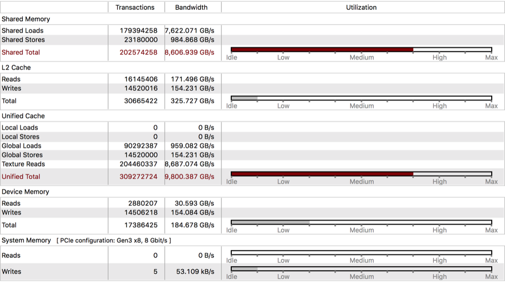

# Optimized High-Performance CUDA Forward Convolution

Ranking No.1 among all the competing teams!


## Milestone 1

### Time profile

A list of kernels that collectively consume more than 90% of the program time:

Kernels | Time Percentage
--- | ---
CUDA memcpy HtoD | 38.92% |
cudnn::detail::implicit_convolve_sgemm | 20.80% |
volta_cgemm_64x32_tn | 12.15% |
op_generic_tensor_kernel | 7.20% |
fft2d_c2r_32x32 | 5.87% |
volta_sgemm_128x128_tn | 5.75% |
cudnn::detail::pooling_fw_4d_kernel | 4.62% |
fft2d_r2c_32x32 | 3.81% |

A list of API calls that collectively consume more than 90% of the program time:

| API calls | Time Percentage |
| --- | ---
| cudaStreamCreateWithFlags | 42.73% |
| cudaMemGetInfo | 33.95% |
| cudaFree | 21.13% |

Difference between kernels and API calls:
* Kernels are the user-implemented functions on GPU device with `__global__` declaration specifier. These functions will be executed by all threads in parallel. Each thread will be assigned a built-in variable (stored in its register) when executing the kernel functions.
* API calls are implemented and provided by the CUDA, whose names usually start with `cu*()` or `cuda*()`. They consist a minimal set of extensions to the C language and a runtime CUDA library. API calls include driver APIs and runtime APIs.

<!--
Kernel functions are compiled by Device Just-In-Time Compiler. API functions are compiled by Host C Compiler/Linker. (Note: this is actually not right, some runtime APIs can also be called in kernel functions, e.g. one kernel can launch another kernel).
-->

### Standard Output

Output of rai running MXNet on CPU:
~~~bash
Loading fashion-mnist data... done
Loading model... done
New Inference
EvalMetric: {'accuracy': 0.8236}
~~~

Output of rai running MXNet on GPU:
~~~bash
Loading fashion-mnist data... done
Loading model... done
New Inference
EvalMetric: {'accuracy': 0.8236}
~~~

As can be seen, the output accuracy are identical for CPU and GPU version.

### Run time

Program run time (in second):

| Hardware | user | system | elapsed |
| --- | --- | --- | --- |
| CPU | 9.12 | 3.58 | 0:05.25 |
| GPU | 4.24 | 3.03 | 0:04.12 |

<!--
In Linux manual, the default format time string is:

%Uuser %Ssystem %Eelapsed %PCPU (%Xtext+%Ddata %Mmax)k
%Iinputs+%Ooutputs (%Fmajor+%Rminor)pagefaults %Wswaps

%U     Total number of CPU-seconds that the process spent in user mode.
%S     Total number of CPU-seconds that the process spent in kernel mode.
%E     Elapsed real time (in [hours:]minutes:seconds).
%P     Percentage of the CPU that this job got, computed as (%U + %S) / %E.
-->

As can be seen, the user time and elapsed real time of GPU version are both shorter than CPU version.

<div style="page-break-after: always;"></div>

## Milestone 2

### CPU Implementation

A CPU version has been implemented in `new-forward.h` and tested execution time and correctness on different data size.

### Program Execution Time

| Data Size | user | system | elapsed |
| --- | --- | --- | --- |
| 100 | 3.11 | 2.67 | 0:01.03 |
| 1000 | 4.39 | 2.78 | 0:01.92 |
| 10000 | 14.32 | 4.39 | 0:10.60 |

### Operator Time
| Data Size | Op time 1 | Op time 2 |
| --- | --- | --- |
| 100 | 0.031691 | 0.067879 |
| 1000 | 0.223601 | 0.686639 |
| 10000 | 2.158946 | 6.900892 |

### Correctness

| Data Size | Correctness  |
| --- | --- |
| 100       | 0.84 |
| 1000      | 0.852 |
| 10000     | 0.8397 |

<div style="page-break-after: always;"></div>

## Milestone 3

### GPU Implementation

A GPU version has been implemented in `ece408_src/new-forward.cuh` and tested execution time and correctness on different data size. As can be seen, the GPU version brings significant performance improvements over the CPU version.

### Program Execution Time

| Data Size | user | system | elapsed |
| --- | --- | --- | --- |
| 100 | 4.24 | 3.14 | 0:04.12 |
| 1000 | 4.34 | 3.42 | 0:04.21 |
| 10000 | 4.49 | 3.17 | 0:04.32 |

### Operator Time
| Data Size | Op time 1 | Op time 2 |
| --- | --- | --- |
| 100 | 0.000113 | 0.000240 |
| 1000 | 0.000894 | 0.002468 |
| 10000 | 0.008905 | 0.024344 |

### Correctness

| Data Size | Correctness  |
| --- | --- |
| 100       | 0.84 |
| 1000      | 0.852 |
| 10000     | 0.8397 |

### Performance Results

`nvprof` and NVVP are used to profile the program. Note that only the results from the default data size (10000) are presented in the report for conciseness.

#### `nvprof`

A list of kernels that collectively consume more than 90% of the program time:

| Kernels | Time Percentage |
| --- | --- |
| mxnet::op::forward_kernel | 57.89% |
| CUDA memcpy HtoD | 28.49% |
| volta_sgemm_32x128_tn | 4.31% |
| mshadow::cuda::MapPlanLargeKernel | 4.17% |

A list of API calls that collectively consume more than 90% of the program time:

| API calls | Time Percentage |
| --- | --- |
| cudaStreamCreateWithFlags | 49.20% |
| cudaMemGetInfo | 29.69% |
| cudaFree | 18.78% |

#### NVVP

The NVVP profile is shown below. Our `::forward_kernel` has `77%` importance of the total compute time.


<!--
How to NVVP?
# Follow the tutorial and install NVVP on EWS.
open by: ~/software/cuda-10.0/bin/nvvp &

# Run nvprof command in yaml
- nvprof -o timeline.nvvp python m3.1.py # output profile for nvvp, download it from the AWS link
- nvprof --kernels "::forward:1" --analysis-metrics -o forward1_analysis.nvprof python m3.1.py
- nvprof --kernels "::forward:2" --analysis-metrics -o forward1_analysis.nvprof python m3.1.py

# Follow the AWS link and download file
unzip by: tar -xvf <filename.tar.gz>

# NVVP: File > Import > Nvprof > Single process
open timeline.nvvp file as timeline data
open *analysis.nvprof as event/metrics data

-->

## Milestone 4

### GPU Optimization 1: Use Constant Memory for Masks

Constant memory is used to stored the mask/weight tensor in this optimization. As compared to original GPU optimization that stores the mask tensor in global memory (~500 cycles read), read from constant memory is faster (~5 cycles read with caching).

However, since the given mask tensor was by default allocated in global memory, we need to first copy them to constant memory by `cudaMemcpyToSymbol`, which brings some redundancy/overhead during memory copy. Therefore, the optimization effect is not significant.

Detailed analysis with `nvprof` and `NVVP` are shown below.

#### `nvprof` for Optimization 1
<p align="center">

</p>

#### NVVP for Optimization 1
_**Timeline**_


_**Overview**_
| Layer 1 | Layer 2 |
| --- | --- |
|||

_**Kernel Performance Limiter**_
| Layer 1 |  |
| :---: | --- |
| **Layer 2** |  |

_**Kernel Memory**_
| Layer 1 |  |
| :---: | --- |
| **Layer 2** |  |

_**Runtime**_
| Optimization Version | Op time 1 | Op time 2 | Total Op time |
| :---: | :---: | :---: | :---: |
| Baseline | 0.008905 | 0.024344 | 0.033249 |
| **1** | **0.008391** | **0.023134** | **0.031525** |

_**Analysis**_
In this optimization, constant memory is used for masks to reduce the global memory accesses.

The kernel in this optimization is compute bounded, as the kernel's computation takes up higher proportion in GPU's activities than `memcpy`. And from the utilization chart, the compute category is about 35% higher than that of memory. However, both of the categories are lower than 70%, so it can be optimized so that more of the GPU resources are utilized. In NVVP, it shows that there is a drop in Global load and store efficiencies in the second layer, so optimizations could be done based on different data sizes so that the kernel can handle both layers well. Both passes of the kernel exhibit warp efficiency problems, so it means the code should be modified to reduce control divergence. The memory analysis in NVVP shows shared memory is in idle, since we did not use any shared memory. We should utilize shared memory in next optimizations to achieve better performance.

As a summray, using constant memory to store mask weights helps save time loading them from global memory, and it does make a progress in operator time comparing to the plain implementation.

### GPU Optimization 2: Unroll Input Images + Shared Memory Matrix Multiply

In this optimization, the input feature maps are first unrolled into matrix form, and general matrix multiplication is applied to get the output feature maps. Two separate kernels, `unroll_kernel` and `gemm_kernel` are used, and extra amount of memory for the unrolled feature maps is allocated. The unrolling details are described in lecture and textbook. As compared to basic 2D convolution or shared-memory convolution, convolution in matrix form is expected to have more compact computation and less control divergence.

However, two separate kernel launches introduce significant overhead of memory allocation and memory access. A simple calculation indicates that for the two convolutional layers, the unrolled matrix consumes memory `BxCxKxKxH_outxW_out` with `10000 x 1 x 5 x 5 x 44 x 44 x 4 = 1.80 GB` and `10000 x 6 x 5 x 5 x 18 x 18 x 4 = 1.81 GB`, respectively. Such great overhead actually lower the performance of the entire process. Therefore, the runtime for operator 2 is almost identical to non-optimization GPU version, but for operator 1 it even slows down the runtime.

Detailed analysis with `nvprof` and `NVVP` are shown as follows.

#### `nvprof` for Optimization 2
<p align="center">

</p>

#### NVVP for Optimization 2
_**Timeline**_


_**Overview**_
| Layer 1 `unroll` | Layer 1 `gemm`|
| :---: | :---: |
|||
| **Layer 2 `unroll`** | **Layer 2 `gemm`** |
|||

_**Kernel Performance Limiter**_
| Layer 1 `unroll` | Layer 1 `gemm`|
| :---: | :---: |
|||
| **Layer 2 `unroll`** | **Layer 2 `gemm`** |
|||

_**Kernel Memory**_
| Layer 1 `unroll` | Layer 1 `gemm`|
| :---: | :---: |
|||
| **Layer 2 `unroll`** | **Layer 2 `gemm`** |
|||

_**Runtime**_
| Optimization Version | Op time 1 | Op time 2 | Total Op time |
| :---: | :---: | :---: | :---: |
| Baseline | 0.008905 | 0.024344 | 0.033249 |
| 1 | 0.008391 | 0.023134 | 0.031525 |
| **2** | **0.025679** | **0.021217** | **0.046896** |

_**Analysis**_
From the observation of optimization 1, only implement constant memory can’t optimize the performance of the program that much. Motivated by the shared-memory multiplication idea, we implement two separate kernels. The first one is intended for unrolling the convolution operation to matrix multiplication. The second one is for general matrix multiplication application.

 - Unroll kernel (`unroll` kernel): This is a memory-bounded kernel since most of the computationally heavy task is `memcpy`, read from global to shared memory and write back from shared memory to global memory. From the result figures we can clearly find that, the unroll kernel compute utilization is only 18% while the memory utilization is already 65%. This implies that the memory reuse can really accelerate the program for optimization method 2 unroll kernel. Additional, the major stall reason is memory throttle which is still memory bottleneck. The active blocks in the Occupancy analysis per SM shows that our shared memory usage per block is too high that only two blocks can be fitted into one SM. From the overall efficiency summary, the wrap execution is the bottleneck for the kernel. Potential improvements include increasing shared memory reuse and reducing the control divergence.

 - General matrix multiplication kernel (`gemm` kernel): This is also a memory-bounded kernel since most computation intensive steps are memory read and write. Similar to tiled matrix multiplication idea, we use shared memory for threads in a block. Each thread will sequentially execute `load-sync-compute-sync-write` logic. From the result figures we can find that this kernel is more balanced between compute limitation and memory limitation compared with the unroll kernel. However, it’s still a memory-bound kernel. For both layers, the utilization of compute is around 40% while the utilization of memory is 65%. Pipe busy is the major source of stalling and active blocks per SM is still `2`, which is relatively low compared to the device limit `32`. The overall efficiency summary points out the shared memory efficiency is the bottleneck for this kernel. Potential improvements include fusing `unroll` kernel and `gemm` kernel to minimize the overhead of global memory read and write overhead.

As a summary, this optimization doesn’t offer instant performance improvements due to the large memory-bound overhead between `unroll` kernel and `gemm` kernel. However, the fusion of these two kernels could bring promising efficiency enhancement, as explored in optimization 3.

### GPU Optimization 3: Kernel Fusion

To address the major concern in Optimization 2, the two kernels are fused into one, with in-place unrolling (or conceptual unrolling) that consumes less amount of extra memory allocation. When doing matrix multiplication, threads will load the elements from locations in the input feature maps as if they are working on the unrolled version of `x` matrix. The performance improvement of this optimization is significant because it utilizes the benefits of matrix form convolution while avoids aforementioned redundancy/inefficiency of memory allocation/access.

Detailed analysis with `nvprof` and `NVVP` are shown as follows.

#### `nvprof` for Optimization 3
<p align="center">

</p>

#### NVVP for Optimization 3
_**Timeline**_


_**Overview**_
| Layer 1 | Layer 2 |
| --- | --- |
|||

_**Kernel Performance Limiter**_
| Layer 1 |  |
| :---: | --- |
| **Layer 2** |  |

_**Kernel Memory**_
| Layer 1 |  |
| :---: | --- |
| **Layer 2** |  |

_**Runtime**_
| Optimization Version | Op time 1 | Op time 2 | Total Op time |
| :---: | :---: | :---: | :---: |
| Baseline | 0.008905 | 0.024344 | 0.033249 |
| 1 | 0.008391 | 0.023134 | 0.031525 |
| 2 | 0.025679 | 0.021217 | 0.046896 |
| **3** | **0.018568** | **0.015839** | **0.034407** |

_**Analysis**_
From the observation of optimization 2, we can further accelerate the kernel by combining the two separate kernels together to eliminate the read and write overhead. Motivated by this idea, our group implement a fused kernel on top of optimization 2.

Different from the original kernel and optimization 2 kernel, the operator time of layer 2 is slightly faster than layer 1 in this optimization, which means the `unroll+gemm` fused kernel is a promising optimization layer 2. The global store efficiency is greatly improved with the first layer reaching 100%, but the shared memory efficiency is low, so we should focus on reusing the data loaded in shared memory for the next optimiaztions. This kernel is also compute bounded, but the memory is comparable to the compute from the chart and the two utilizations are still low, so we should try to utilize more of the GPU resources. However the NVVP also shows that all the SMs are working 100%, so it could mean that the GPU in use has more resources than what we need to run the kernel in this problem. In the memory analysis, the shared memory is being used heavily. The unified memory cache is also very high, and this is good because we are reusing a lot of data in the cache instead of from global memory.

In summary, this optimization made the overall computation faster because it used matrix multiplication form and reduced the overhead from optimization 2. Looking at the runtime, we can observe that the layer 2 is optimized from the plain version, but layer 1 is much slower than even the no-optimization version. This indicates the optimization effects should be fine-tuned with layer-specific parameters (tile width, block size, etc.). Moreover, this could also imply that, for layer 1, optimizations on the original convolution form might be more effective.

<!-- Some Notes of NVVP
`nvprof -o timeline.nvprof python 1.py` only gives a general info, to do detailed profiling:
  [--kernels] kernel-specific analysis
  [--analysis-metrics] gives all related GPU info

directly `nvvp forward1_analysis.nvprof` in terminal, look into several key features:

[Guided/unguided analysis] On the top menu of the analysis subwindow, you can choose preset analysis or customized one

[Examine individual kernels]
  low kernel concurrency - ok, usually hardware limitation
  low compute utilization - indicates grid/block dim is too small

[Kernel performance limiter] Bar of Function Unit is best to be almost equivalent to Bar of memory

[Kernel memory]

[Global memory access pattern] locate all lines in code that access global memory

[Memory Statistics] cache miss

[Kernel Profile - PC sampling] what are the limiting factors

[Data movement and concurrency] (not relevant for this project) streaming

Some statistics of last semester's top teams:
1. Timing. 23 ms for test dataset, 9ms for grading dataset. (Note the machines are different between semesters, this year Turing machine offers much faster performance)

2. Layout
  Register: Use all 64 registers/per thread
  Grid: (10000,1,1) ???
  Block: (27,9,1) ???
  Shared memory: ~6.5KB/block
  Active Warps: 31.83 (close to max 32)
  they make the block small, and load as much as they can into shmem. further optimization can be done using register tiling. (register 1 cycle > shmem 4 cycles)

3. Performance
  Kernel latency: stall reasons is mainly `pipe busy`. which is ideal.
  Multiprocessor utilization: ~100%. ideal.

4. Extra innovative optimization
  Mixed floating-point precision
  Pre-fetch data, i.e. double buffering for threads to load data for next iteration
-->

<div style="page-break-after: always;"></div>

## Final Version

### GPU Optimization 4: Tuning with restrict and loop unrolling & Multiple kernel implementations for different layer size

This optimization is a relatively trivial one since it is mainly based on compiler optimization rather than implementing new GPU algorithms. Compiler optimizations such as `__restrict__` [restrict pointer declaration](https://stackoverflow.com/questions/745870/realistic-usage-of-the-c99-restrict-keyword) and [`#pragma unroll`](https://docs.nvidia.com/cuda/cuda-c-programming-guide/index.html#pragma-unroll) [loop unrolling](https://stackoverflow.com/questions/22278631/what-does-pragma-unroll-do-exactly-does-it-affect-the-number-of-threads) are added to the code.

With `__restrict__` keyword, the programmer tells the compiler to seek for optimizations when assembling those non-aliasing pointers. Three input pointers, `y`, `x`, and `k` are passed in as restrict pointer to the GPU kernel. With `#pragma unroll` keyword, the programmer tells the compiler to unroll the for-loop iterations into sequential instructions. Loop unrolling helps reduce the processing workload for the processor, and enhance [Instruction-Level Parallelism (ILP)](https://en.wikipedia.org/wiki/Instruction-level_parallelism). With iteration count known for each convolutional layer, compile-time macros are defined accordingly.

Furthermore, for this optimization, customized kernels for each layer are implemented and tested with different tile size, block size, shared memory, etc. Also, variables with known values are all used (hard-coded) as constants to minimize memory indirection and redundant calculation.

The effect of compiler optimization as well as the customized layer-specific kernel is significant. As can be seen, the operator time is reduced greatly from previous optimizations.

_**Runtime**_
| Optimization Version | Op time 1 | Op time 2 | Total Op time |
| :---: | :---: | :---: | :---: |
| Baseline | 0.008905 | 0.024344 | 0.033249 |
| 1 | 0.008391 | 0.023134 | 0.031525 |
| 2 | 0.025679 | 0.021217 | 0.046896 |
| 3 | 0.018568 | 0.015839 | 0.034407 |
| **4** | **0.003297** | **0.006088** | **0.009385** |

Accuracy of the inference kernel stays at `0.8397`, which validates the correctness of the implementation.

Detailed analysis with `nvprof` and `NVVP` are shown below.

#### `nvprof` for Optimization 4
<p align="center">

</p>

#### NVVP for Optimization 4
_**Timeline**_


_**Overview**_
| Layer 1 | Layer 2 |
| --- | --- |
|||

_**Kernel Latency**_
| Layer 1 |  |
| :---: | --- |
| **Layer 2** |  |

_**Kernel Performance Limiter**_
| Layer 1 |  |
| :---: | --- |
| **Layer 2** |  |

_**Kernel Memory**_
| Layer 1 |  |
| :---: | --- |
| **Layer 2** |  |

_**Analysis**_
This optimization does not use a different method from the last one to make the kernels faster, instead it focuses on the coding of the method in optimization 3 and utilizes the compiler optimizations to improve the runtime.

Comparing to the original fused kernel in optimization 3, the first layer duration has been reduced by 82.05%, while it is 61.58% for the second layer, so this optimization is more applicable to the first layer in the neural network, and this could indicate that there are more loops being unrolled in the first layer or that the amount of floating point operations in the code that can be hard-coded as constants is larger than that of second layer. Since the two layers use two different kernels that are specially tuned for their specific data sizes, the result could also show that the parameters in first layer are more fine-tuned. From the `nvprof` of this optimiaztion and the last one, the GPU activity time for the kernels has reduced by 47% and there is a rise in memcpy, showing that our kernels became fater. The kernel latency figure shows that our kernel utilizes SMs well with all approaching the device limit except for active blocks, which we could work on to improve for the next optimization. Because of the configurations of blocks, the warp and register utilizations are relatively low. The layer 1 is compute bounded as it should be from the performance limiter figure, but the second layer became memory bounded after this optimization. Finally, the memory usage is the same as in optimization 3.

In summary, although this optimzation seems trivial in that it merely improves on the coding of the former optimization, it makes a huge difference in the total operator time, showing that the efficiency of floating-point operations within the kernel can be improved significantly. Also, for next optimization, the parameters for the second layer kernel could be improved to further reduce the operation time.

<div style="page-break-after: always;"></div>

**Note:
Optimization 1 ~ 4 above are recommended ones listed in the project website. At this point, we try to further boost the performance of the code and think some advanced techniques should be implemented. Hence, a literature review is first conducted and information on popular GPU optimization techniques is gathered.**

Useful resources (of both high-level concepts and implementation details) include but is not limited to the following topics:
- [Volkov, Vasily, and James W. Demmel. "Benchmarking GPUs to tune dense linear algebra." SC'08: Proceedings of the 2008 ACM/IEEE conference on Supercomputing. IEEE, 2008.](https://mc.stanford.edu/cgi-bin/images/6/65/SC08_Volkov_GPU.pdf) On important factors affecting GPU performance.
- [cuDNN library.](https://arxiv.org/pdf/1410.0759.pdf) On optimization techniques used in cuDNN (it also mentions an [algorithm](https://arxiv.org/pdf/1410.0759.pdf) of transforming integer division and modulo operation to integer multiplies and shifts).
- [cuBLAS library](https://docs.nvidia.com/cuda/cublas/index.html)
- [Volkov, V., 2016. Understanding latency hiding on gpus (Doctoral dissertation, UC Berkeley).](https://www2.eecs.berkeley.edu/Pubs/TechRpts/2016/EECS-2016-143.pdf) PhD work on GPU latency hiding techniques.
- [Merry, Bruce. "Faster GPU-based convolutional gridding via thread coarsening." Astronomy and Computing 16 (2016): 140-145.](https://arxiv.org/abs/1605.07023) On details of thread coarsening in convolution.
- [Ben-Sasson, Eli, Matan Hamilis, Mark Silberstein, and Eran Tromer. "Fast multiplication in binary fields on gpus via register cache." In Proceedings of the 2016 International Conference on Supercomputing, p. 35. ACM, 2016.](https://dl.acm.org/citation.cfm?id=2926259) On details of using register cache and warp-level communication.
- [Ho, Nhut-Minh, and Weng-Fai Wong. "Exploiting half precision arithmetic in Nvidia GPUs." In 2017 IEEE High Performance Extreme Computing Conference (HPEC), pp. 1-7. IEEE, 2017.](https://ieeexplore.ieee.org/document/8091072) On details of half precision operations.
- [Unrolling parallel loops.](https://www.nvidia.com/docs/IO/116711/sc11-unrolling-parallel-loops.pdf) On details of loop unrolling.
- [Register tiling and thread coarsening.](https://iccs.lbl.gov/assets/docs/2011-01-24/lecture5_data_optimization_2011.pdf) On details of using register tiling.
- [Matrix multiplication application in deep learning.](https://petewarden.com/2015/04/20/why-gemm-is-at-the-heart-of-deep-learning/)

After reviewing the literature, we think it is really worth implementing some interesting optimization techniques that are not covered in this course and decide to implement Optimization 5 and 6 as follows:
- **Optimization 5: Use register cache and warp-level communication.**
- **Optimization 6: Use half precision floating point operation.**

In addition, Optimization 5 and 6 are our "featured" optimizations that are highlighted in this report and they help our final version to rank top 3 among the teams.

<div style="page-break-after: always;"></div>

### GPU Optimization 5: Thread Coarsening and Register Cache with Warp-Level Communication

**References**:
- [1] Paper: [Ben-Sasson, Eli, Matan Hamilis, Mark Silberstein, and Eran Tromer. "Fast multiplication in binary fields on gpus via register cache." In Proceedings of the 2016 International Conference on Supercomputing, p. 35. ACM, 2016.](https://dl.acm.org/citation.cfm?id=2926259)
- [2] Documentation: [CUDA Documentation on warp shuffle methods](https://docs.nvidia.com/cuda/cuda-c-programming-guide/index.html#warp-shuffle-functions)
- [3] NVIDIA developer blog: [#1](https://devblogs.nvidia.com/register-cache-warp-cuda/)
- [4] NVIDIA developer blog: [#2](https://devblogs.nvidia.com/using-cuda-warp-level-primitives/)

For this optimization, register cache and warp-level communication are implemented along with thread coarsening concept. We have also learned a lot from the implementation of this optimization by exploring a different type of data reuse technique other than shared memory (although the implementation detail is more complex and architecture dependent).

_**Thread Coarsening**_
Rectangular tiling is used to utilize thread coarsening effect. When loading tiles of unrolled `x`, each thread will collaborate load from global memory multiple times. This allow a larger shared memory, therefore further increase the memory bandwidth and data reusage. For example, small `2x16` blocks `dim3 blockDim(16, 2, 1)` are now used, but they will load `16x16` tiles from `k` and `x`, with each thread load 8 times along y direction.

It is also observed that larger shared memory usage does not always lead to better performance. This can be explained by the mechanism of Streaming Multiprocessor (SM): SM has limitation on total shared memory, so if a block use too much shared memory, SM may only be able to accommodate fewer blocks, which leads to poor multiprocessor utilization. Therefore, there is trade-off between larger memory bandwidth and higher multiprocessor utilization.

_**Register Cache**_
Note that register cache technique is different from (and much more difficult than) the "register tiling" technique. It is an optimization technique that develops a virtual caching layer for threads in a single warp. The data is loaded into registers of each thread and ends up being distributed across registers in the threads of each warp, and shared memory accesses are replaced with accesses to registers in other threads by using warp-level CUDA intrinsic `shuffle` functions, thereby enabling significant performance benefits.

Function signature:
```c
T __shfl_sync(unsigned mask, T var, int srcLane, int width=warpSize);
```

Threads within a warp are referred to as lanes, and may have an index between `0` and `warpSize-1` (inclusive).

The `__shfl_sync()` intrinsics permit exchanging of a variable between threads within a warp without use of shared memory. The exchange occurs simultaneously for all active threads within the warp, moving 4 or 8 bytes of data per thread depending on the type. The main benefit of this technique is to replace the usage of shared memory and block-level `__syncthreads` with the usage of register and intrinsic warp-level synchronization offered by **SIMT** (Single Instruction, Multiple Threads) architecture of CUDA.

Therefore, in the kernel of this optimization, there is no usage of shared memory, no single `__syncthreads()` call, and a 1.5x speedup is still achieved, as shown below:

_**Runtime**_
| Optimization Version | Op time 1 | Op time 2 | Total Op time |
| :---: | :---: | :---: | :---: |
| Baseline | 0.008905 | 0.024344 | 0.033249 |
| 1 | 0.008391 | 0.023134 | 0.031525 |
| 2 | 0.025679 | 0.021217 | 0.046896 |
| 3 | 0.018568 | 0.015839 | 0.034407 |
| 4 | 0.003297 | 0.006088 | 0.009385 |
| **5** | **0.002342** | **0.003991** | **0.006333** |

Accuracy of the inference kernel stays at `0.8397`, which validates the correctness of the implementation.

Detailed analysis with `nvprof` and `NVVP` are shown below.

#### `nvprof` for Optimization 5
<p align="center">

</p>

#### NVVP for Optimization 5
_**Timeline**_


_**Overview**_
| Layer 1 | Layer 2 |
| --- | --- |
|||

_**Kernel Latency**_
| Layer 1 |  |
| :---: | --- |
| **Layer 2** |  |

_**Kernel Performance Limiter**_
| Layer 1 |  |
| :---: | --- |
| **Layer 2** |  |

_**Kernel Memory**_
| Layer 1 |  |
| :---: | --- |
| **Layer 2** |  |

_**Analysis**_
Same as the last optimization, this one also makes a huge improvement on the performance, reducing the total operator time by 32.5%. `NVVP` reports that the kernel has high local memory overhead, accounting for about 30% of total traffic for both layers, and that is expected, since we are using register cache to reduce the memory latency, more loads and reads should be done in local memory. The low shared memory usage shown in the kernel memory figure also indicates that the optimization is done correctly, with the shared memory accesses replaced by accesses to registers in other threads using `shuffle`, thereby enabling significant performance benefits. The kernel performance limiter does not differ from that of the last optimization, so the kernel in layer 2 is still memory bounded. It may be a fact that after the optimizations, there are less compute than memory operations to perform for layer 2. If that is the case, we would not be able to make it any more optimized on this aspect. The kenrel latency for both layers are opposite of what it looked like last time for occupancy per SM. This time the active blocks are higher since each block is smaller and more active blocks per SM, and the rest are lower for the same reason. Because of warp-level cache, each block contains one warp, and as there is a limit for the number of blocks, the number of warps and threads in the block are limited.

In brief, this optimization is successful in terms of result. By the way, we also learned that although `NVVP` shows a full inspection of the kernel's multiple aspects, the low efficiency it shows does not always mean a performance drop. Instead, sometimes it may be a sign of a successful implementation due to different/special scheme the programmer adopts.

<div style="page-break-after: always;"></div>

### GPU Optimization 6: Mixed-precision Floating Point Operation on FP16

**References**:
- [1] Paper: [Ho, Nhut-Minh, and Weng-Fai Wong. "Exploiting half precision arithmetic in Nvidia GPUs." In 2017 IEEE High Performance Extreme Computing Conference (HPEC), pp. 1-7. IEEE, 2017.](https://ieeexplore.ieee.org/document/8091072)
- [2] Documentation: [CUDA Documentation on half-precision](https://docs.nvidia.com/cuda/cuda-math-api/modules.html#modules)
- [3] NVIDIA developer blog: [#1](https://devblogs.nvidia.com/mixed-precision-programming-cuda-8/)
- [4] NVIDIA developer blog: [#2](https://devblogs.nvidia.com/speed-up-inference-tensorrt/)

For this optimization, mixed-precision floating point operation is applied in the matrix multiplication step. As a background, Deep Neural Network architectures usually have a natural resilience to errors due to the back propagation algorithm used in training, so some have argued that 16-bit floating point (half precision, or FP16) is sufficient for training neural networks. Within certain tolerance of training accuracy, FP16 could be used to further accelerate the program.

_**Half Precision**_
This optimization can actually be built on top of optimization 5 because the warp shuffle primitive functions [support half-precision operations](https://docs.nvidia.com/cuda/cuda-c-programming-guide/index.html#warp-shuffle-functions):
```c
T __shfl_sync(unsigned mask, T var, int srcLane, int width=warpSize)
```
where data type `T` can be `__half` or `__half2` with the `cuda_fp16.h` header included.

The variables `rc_W`, `rc_X`, `rc_result` stored in register cache are now declared as 2-way floating point `half2`. The multiplication-add is now divided into the following steps:

- **Step 1: Combine**
Two single-precison floating point values now collapse into one 2-way half precision value, by primitive CUDA functions `__float2half`, `__half2half2`, `__halves2half2`, `__float2half2_rn`.

- **Step 2: Multiply-Add**
Primitive CUDA function `__hfma2` is used to execute the 2-way half-precision operation.

- **Step 3: Extract**
The results from half-precision operations should be converted to the final results in single-precision `float` form. Therefore, the low 16-bit and high 16-bit are extracted by primitive functions `__low2float` and `__high2float`.

_**Hybrid Shared Memory with Register Cache**_
As stated in optimization 5, the register caching technique can fully utilize the SIMT architecture and reduce the explicit block-level synchronization calls. On the other hand, the access pattern to the mask weights `k` is highly "redundant" and indicate some data reusage can be exploited. Therefore, in this optimization we use a hybrid scheme:
- Use shared memory for `k`
  - Option 1: small shared memory size, reload in each iteration. Kernel is named as `*_local_shmem()`
  - Option 2: large shared memroy size, load all elements at the beginning. Kernel is named as `*_full_shmem()`
- Use register cache for `x`

The hybrid scheme gives the best performance when we use Option 2 for layer 1 and Option 1 for layer 2. This can be explained by the fact that the mask weights of layer 1 is a pretty small array that can easily fit into shared memory.

About 1.5x speedup is achieved by optimization 6, as shown below:

_**Runtime**_
| Optimization Version | Op time 1 | Op time 2 | Total Op time |
| :---: | :---: | :---: | :---: |
| Baseline | 0.008905 | 0.024344 | 0.033249 |
| 1 | 0.008391 | 0.023134 | 0.031525 |
| 2 | 0.025679 | 0.021217 | 0.046896 |
| 3 | 0.018568 | 0.015839 | 0.034407 |
| 4 | 0.003297 | 0.006088 | 0.009385 |
| 5 | 0.002342 | 0.003991 | 0.006333 |
| **6** | **0.001719** | **0.002386** | **0.004105** |

In addition, due to the implementation of half-precision floating point FP16, the accuracy of the inference step changes a little (which is expected since truncation occurs when using lower precision numerical representation). As a result, the correctness value of the `10000` images dataset increases from 0.8397 to 0.8398 in this optimization (as shown below), while for `100` and `1000` dataset the correctness is not affected. To validate this result, we have communicated with Professor and TAs and confirmed that this is reasonable and acceptable.

_**Correctness (Dataset size = 10000)**_
|Optimization Version|  Correctness |
| :---: | :---: |
| Baseline | 0.8397 |
|  1  |  0.8397  |
|  2  |  0.8397  |
|  3  |  0.8397  |
|  4  |  0.8397  |
|  5  |  0.8397  |
|  **6**  |  **0.8398**  |

Detailed analysis with `nvprof` and `NVVP` are shown below.

#### `nvprof` for Optimization 6
<p align="center">

</p>

#### NVVP for Optimization 6
_**Timeline**_


_**Overview**_
| Layer 1 | Layer 2 |
| --- | --- |
|||

_**Kernel Latency**_
| Layer 1 |  |
| :---: | --- |
| **Layer 2** |  |

_**Kernel Performance Limiter**_
| Layer 1 |  |
| :---: | --- |
| **Layer 2** |  |

_**Kernel Memory**_
| Layer 1 |  |
| :---: | --- |
| **Layer 2** |  |

_**Kernel Compute**_
_Instruction Execution Counts_
| Layer 1 |  |
| :---: | --- |
| **Layer 2** |  |

_Floating Point Operation Counts_
| Layer 1 |  |
| :---: | --- |
| **Layer 2** |  |

_**Stall Reasons**_
| Layer 1 | Layer 2 |
| --- | --- |
|||

_**Analysis**_
After this optimization, the portion of GPU activities for the kernels further decreases, showing the increase in the performance. Same as last optimization, memory analysis also shows high local memory overhead, which is a byproduct of register cache. The kernel latency figures suggest that the occupancy is not 100% but is large enough that higher occupancy would not always lead to higher performance, so this is good enough for this optimization. However the active blocks got much lower than the former one, so there is less parallelism in the SMs, and this could harm the performance. It could be caused by the introduction of shared memory, as the lower part of the figure shows the block limit for shared memory is above the device limit. The large portions of execution dependencies in both layers' stall reasons also show the same problem. The less register usage from overview may also be caused by less register cache and more shared memeory usage. Despite all these apparent drawbacks, the improvements that this optimization brings are promising. From the kernel performance limiters, the second layer finally escaped from being memory bounded and became largely compute bounded. This improvement in the first layer is also notable. With the use of shared memory, the the shared utilization increased, but in exchange, the cache utilization became lower as shown by the memory analysis. Also, because large shared memory and preloading all W for avoiding `__syncthreads()` is used for the first layer, there is a huge increase in the utilization of device memory.

The biggest stall reason for layer 1 is "not selected", meaning the some warps are waiting for other warps to finish. This is caused by the use of register cache, as each block contains one warp, and the number of blocks that can be issued is less than the potential number of warps. On the other hand, the main stall reason for layer 2 is "execution dependency", which means the input for instructions is not yet available, and this could be eliminated by increasing instruction level parallelism.

From the execution counts, it is obvious that after this optimization, we do not have 32-bit floating point operations anymore, and all are replaced by 16-bit floating point operations, as intended to increase the performance.
Moreover for layer 2, the execution count for 16-bit floating point operations reaches a surprising `100%`. Thus, this layer is more compute intensive and the benefit gained from converting to faster 16-bit operations is higher than the first layer.

In this final optimization, we make further improvements upon the former optimizations. Some drawbacks occurs, but they are overshadowed by the benefits came along. As the final result, we are able to achieve 8x speedup of the baseline GPU version, with total operator time reduced to `0.004105s = 4.1ms`.

Happy GPU programming! :)

<div style="page-break-after: always;"></div>
